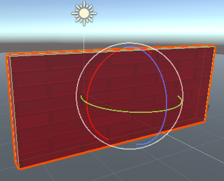

تتيح لك أدوات التحويل التنقل في مساحة ثلاثية الأبعاد في عرض المشهد وتحريك كائنات اللعبة وتدويرها وتوسيع نطاقها.

يمكنك النقر فوق أداة لبدء استخدامها، أو استخدام اختصار لوحة المفاتيح:

+ Q، يد - التجول.
+ W ، ترجمة - تحريك كائن لعبة. اسحب الأسهم الملونة للتحرك في الاتجاهات x و y و z. 
+ R, المقياس - تغير حجم كائن اللعبة. اسحب الدوائر الملونة للدوران في الاتجاهات x و y و z. 
+ R, تحجيم - تحجيم شيء لعبة. اسحب المكعبات الملونة لتغير حجم كائن في الاتجاهات x و y و z. 
+ T ، Rect - تغيير كائن ثنائي الأبعاد مثل النص.

يمكنك أيضا تغيير القيم في نافذة التحويل لكائن اللعبة في المفتش.

**نصيحة:** في بعض الأحيان يكون من الأسهل سحب كائن إلى المكان المناسب تقريبًا باستخدام أدوات التحويل ثم اضبط القيم لتقريب الأرقام في التحويل من أجل تحديد الموضع بدقة.

**نصيحة:** يتم تلوين الاتجاهات بالرموز في عرض المشهد: x باللون الأحمر ، و y باللون الأخضر (لأعلى ولأسفل) ، و z باللون الأزرق.

