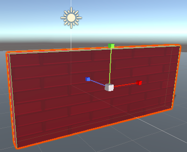

Las herramientas de transformación te permiten moverte en el espacio 3D en la vista de escena y mover, rotar y escalar los objetos del juego.

Puedes hacer clic en una herramienta para comenzar a usarla o usar un atajo de teclado:

+ Q, Hand – Pan around.
+ W, Trasladar: mueve un objeto del juego. Arrastra las flechas de colores para moverte en las direcciones x, y, z. 
+ E, Girar: gira un objeto del juego. Arrastra los círculos de colores para rotar en las direcciones x, y, z. 
+ R, Scale – Resize a game object. Arrastra los cubos de colores para cambiar el tamaño de un objeto en las direcciones x, y, z. 
+ T, Rect – Change a 2D object such as text.

También puedes cambiar valores en la ventana Transform de un objeto de juego en el Inspector.

**Tip:** Sometimes it's easier to drag an object to roughly the right place using the Transform tools and then adjust the values to round numbers in the Transform for accurate positioning.

**Sugerencia:** Las direcciones están codificadas por colores en la vista de escena: x es rojo, y es verde (arriba y abajo) y z es azul. 
