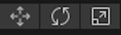

Les outils de transformation te permettent de te déplacer dans l'espace 3D dans la vue Scene et de déplacer, faire pivoter et mettre à l'échelle tes GameObjects.

Tu peux cliquer sur un outil pour commencer à l'utiliser, ou utiliser un raccourci clavier:

+ Q, Main - Panoramique.
+ W, Translate - Déplacer un objet du jeu. Fais glisser les flèches colorées pour te déplacer dans les directions x, y, z. 
+ E, Rotation – Faire pivoter un objet de jeu. Fais glisser les cercles colorés pour les faire pivoter dans les directions x, y, z. 
+ R, Scale - Redimensionner un objet du jeu. Fais glisser les cubes colorés pour redimensionner un objet dans les directions x, y, z. 
+ T, Rect - Modifier un objet 2D tel que du texte.

Tu peux également modifier les valeurs dans la fenêtre Transform d'un GameObject dans l'Inspector.

**Astuce :** Parfois, il est plus facile de faire glisser un objet à peu près au bon endroit à l'aide des outils de transformation, puis d'ajuster les valeurs aux nombres arrondis dans la transformation pour un positionnement précis.

**Astuce :** Les directions sont codées par couleur dans la vue Scene : x est rouge, y est vert (haut et bas) et z est bleu. 
