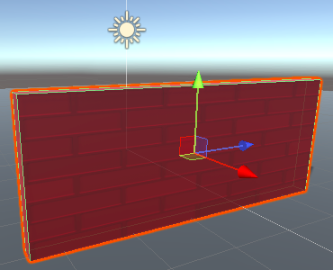
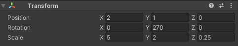

The Transform tools allow you to move around in 3D space in the Scene view and move, rotate, and scale your game objects.

You can click on a tool to start using it, or use a keyboard shortcut:

+ Q, Hand – Pan around.
+ W, Translate – Move a game object. Drag the coloured arrows to move in x, y, z directions. 
+ E, Rotate – Rotate a game object. Drag the coloured circles to rotate in x, y, z directions. 
+ R, Scale – Resize a game object. Drag the coloured cubes to resize an object in x, y, z directions. 
+ T, Rect – Change a 2D object such as text.

You can also change values in the Transform window of a Game object in the Inspector.

**Tip:** Sometimes it's easier to drag an object to roughly the right place using the Transform tools and then adjust the values to round numbers in the Transform for accurate positioning.

**Tip:** The directions are coloured-coded in the Scene view: x is red, y is green (up and down), and z is blue. 
