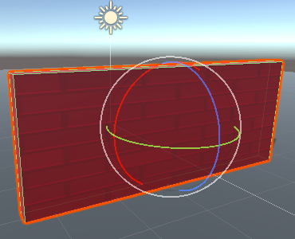

Met de Transform-tools kun je in de Scèneweergave door de 3D-ruimte bewegen en je spelobjecten verplaatsen, draaien en schalen.

Je kunt op een gereedschap klikken om het te gebruiken, of een sneltoets gebruiken:

+ Q, hand – Opzij bewegen.
+ W, Translate – verplaats een spelobject. Sleep de gekleurde pijlen om in de richtingen x, y, z te bewegen. 

+ E, Roteren – Draai een spelobject. Sleep de gekleurde cirkels om te draaien in x-, y-, z-richting. 

+ R, schaal – Wijzig de grootte van een spelobject. Sleep de gekleurde kubussen om het formaat van een object in de richtingen x, y, z aan te passen. 

+ T, Rect – Wijzig een 2D-object zoals tekst.

Je kunt ook waarden wijzigen in het Transform-venster van een Game-object in de Inspector.

**Tip:** soms is het makkelijker om een object naar ongeveer de juiste plaats te slepen met behulp van de Transform-tools en vervolgens de waarden aan te passen of af te ronden in de Transform voor een nauwkeurige positionering.

**Tip:** de richtingen hebben altijd dezelfde kleur in de scèneweergave: X is rood, y is groen (omhoog en omlaag) en z is blauw.
